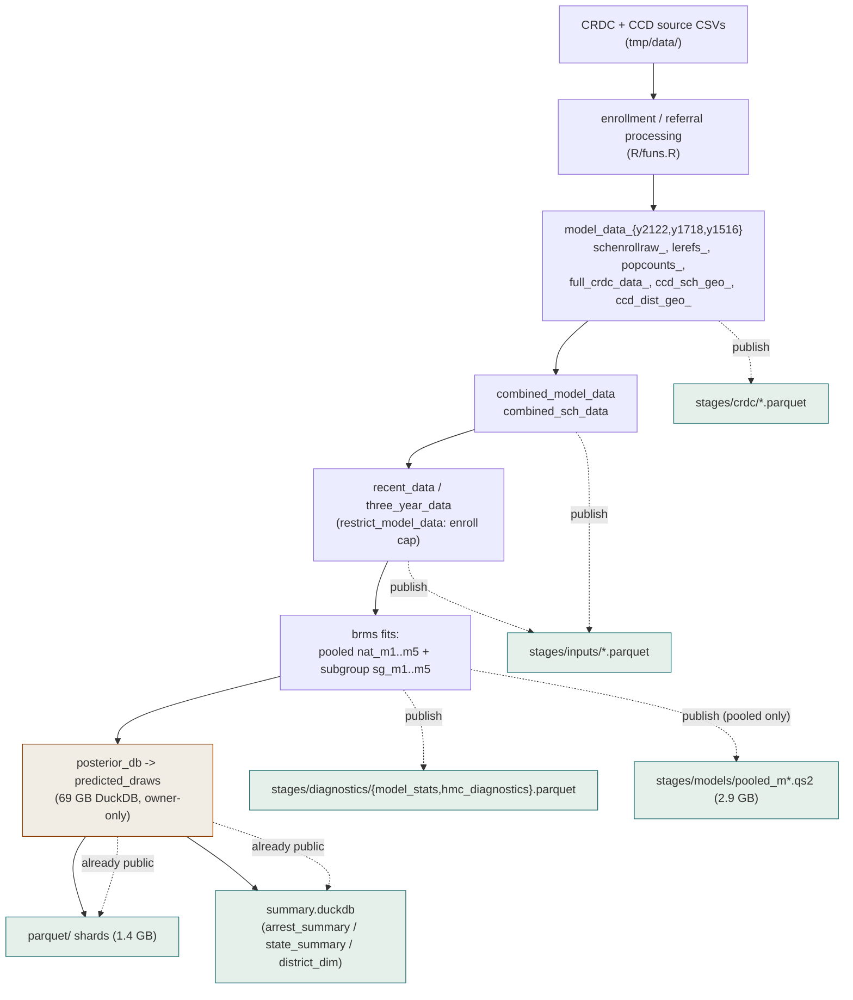

# CRDC Arrests — Data Stages & Artifact Provenance

This map explains the **stages** of the pipeline and the **published artifacts**
emitted at each stage, so you can reproduce any document/figure without the
~7-day model run. It complements the API
[data dictionary](api/data-dictionary.md) (which documents the API summary
tables + draws).

All published artifacts live on the Hugging Face dataset
**`civilytics/crdc-school-arrest-rates`**, pinned to `data_release =
civilytics-crdc-arrests-2025.1`. Documents read them via `crdc_path()` (see
[`REPRODUCIBILITY.md`](../REPRODUCIBILITY.md)): set `CRDC_ARTIFACTS=export` to
read locally (owner), or leave the default `hf://…` (stranger; big objects cache
on first use).

## Pipeline stages → artifacts

Solid arrows are the compute pipeline (owner-side; the `_targets/` store + 69 GB
draws DB never ship). Dashed arrows are the **published** artifacts a stranger
downloads.

## Artifact catalog

### `stages/inputs/` — model-input frames (~65 MB)

| Artifact | Source target | Grain | Consumed by |
|---|---|---|---|
| `three_year_data.parquet` | `three_year_data$data` | LEA × YEAR × RACE × SEX (3-yr restricted) | results, applied_examples, social |
| `recent_data.parquet` | `recent_data$data` | LEA × RACE × SEX (2021-22 restricted) | results, applied_examples, social |
| `combined_model_data.parquet` | `combined_model_data` | school × YEAR (3-yr combined) | results, social, combined_eda |
| `combined_sch_data.parquet` | `combined_sch_data` | school (CCD, 3-yr) | social |

### `stages/crdc/` — raw/intermediate CRDC (~202 MB)

| Artifact (×3 years where suffixed) | Source target | Consumed by |
|---|---|---|
| `full_crdc_data_{y2122,y1718,y1516}.parquet` | `full_crdc_data_*` | results, social |
| `model_data_{…}.parquet` | `model_data_*` | combined_eda, annual/model descriptives |
| `popcounts_{…}.parquet` | `popcounts_*` | results |
| `schenrollraw_{…}.parquet` | `schenrollraw_*` | results |
| `lerefs_{…}.parquet` | `lerefs_*` | results |
| `ccd_sch_geo_{…}.parquet` | `ccd_sch_geo_*` | results |
| `ccd_dist_geo_{…}.parquet` | `ccd_dist_geo_*` | annual/model descriptives |

### `stages/diagnostics/` — model diagnostics (small)

| Artifact | Source | Notes | Consumed by |
|---|---|---|---|
| `model_stats.parquet` | `calculate_model_stats()` over all 10 models | per-model convergence/runtime stats; `model_id` + registry `model_label` ("Pooled (m#)" / "Student-group (m#)"); subgroup models contribute their per-group rows | results (model-stats tables) |
| `hmc_diagnostics.parquet` | pooled fits' sampler diagnostics | divergences / max-treedepth / E-BFMI per pooled model | results (HMC fallback) |

### `stages/models/` — pooled fits (~2.9 GB, optional)

| Artifact | Source target | Notes |
|---|---|---|
| `pooled_m{1..5}.qs2` | `nat_m{1..5}_mod` | the 5 pooled brms fits; let `results.qmd` run **live** `check_hmc_diagnostics()`. Subgroup fits (`sg_*`, ~31 GB) are **not** shipped — their stats come from `model_stats.parquet`. |

### Already public (Subsystem 1)

| Artifact | Notes |
|---|---|
| `parquet/` shards (1.4 GB) | raw posterior draws, partitioned `model_id/YEAR/LEA_STATE`; the docs' `predicted_draws` view reads these |
| `summary.duckdb` (~247 MB) | API summary tables (`arrest_summary`, `state_summary`, `district_dim`, `meta`) |

## Naming note (pooled vs student-group)

The published `model_id` keys are `nat_*` (pooled, all student groups together)
and `sg_*` (one model per student group). Subsystem-3 artifacts **display** these
as "Pooled (m#)" / "Student-group (m#)" via the model registry
(`R/model_registry.R`) — a presentation-only rename. A future deep rename of the
stored `model_id` keys to `pooled_*` is tracked separately (see the spec §I).

## Reproduction download sizes

- **Core** (all docs; diagnostics from the table): `stages/` data (<300 MB) +
  `parquet/` (1.4 GB) ≈ **~1.7 GB**.
- **+ live pooled diagnostics**: add `stages/models/` (~2.9 GB) ≈ **~4.6 GB**.

Versus the owner-side cost this avoids: the 18 GB `_targets/` store, the 69 GB
draws DB, and the ~7-day model run.
