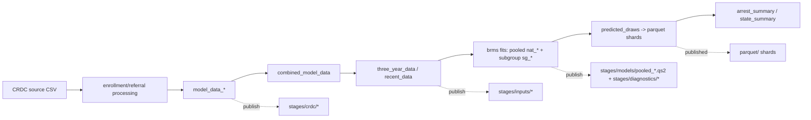

# Artifact Reproduction (Subsystem 3) Implementation Plan

> **For agentic workers:** REQUIRED SUB-SKILL: Use superpowers:subagent-driven-development (recommended) or superpowers:executing-plans to implement this plan task-by-task. Steps use checkbox (`- [ ]`) syntax for tracking.

**Goal:** Let anyone deterministically rebuild the published artifacts (white paper, results, applied examples, social posts, EDA, descriptive reports) from a small public download — no 7-day model run, no 18 GB store, no 69 GB DB.

**Architecture:** New pipeline targets materialize each doc input as portable parquet under `export/stages/` and publish them to the existing HF dataset under `stages/`. Every `.qmd` is re-pointed to read those artifacts with native DuckDB via one thin path-resolver (`crdc_path()`) that caches big objects and direct-reads small ones. Docs become standalone-renderable (no `tar_read` of the store) and are also wrapped as `cue=never` render targets. A new `white_paper.qmd` is ported (pandoc) from `inst/AERA Final Report Knowles Miller_preprint.docx` and shares figure code with the standalone docs (DRY). A presentation-only "pooled" rename is driven by a single model registry; the deep rename + re-run is a concurrent effort on another machine.

**Tech Stack:** R 4.6.0 (renv), `targets`/`tarchetypes`, DuckDB 1.5.2 (+httpfs), `qs2`, Quarto 1.9.37 + `civilytics` brand, `testthat` (3e), pandoc 3.7.

**Spec:** [`docs/superpowers/specs/2026-06-02-artifact-repro-design.md`](../specs/2026-06-02-artifact-repro-design.md)

**Branch:** `feature/artifact-repro` (already created; the spec is committed there).

---

## Conventions for every task

- Run tests with `./scripts/run-tests.sh` (testthat 3e). Run a single file with
  `Rscript -e 'testthat::test_file("tests/testthat/test-<name>.R")'`.
- Use `Rscript` (allowlisted), never `python3`.
- Every DuckDB connection uses the **retained-driver** pattern
  (`drv <- duckdb::duckdb(...); con <- DBI::dbConnect(drv); on.exit({DBI::dbDisconnect(con, shutdown=TRUE); duckdb::duckdb_shutdown(drv)})`)
  — an anonymous `dbConnect(duckdb::duckdb(), …)` gets GC'd → "Invalid connection".
- Commit after each task with a `feat:`/`test:`/`docs:`/`chore:` message. gpg
  signing is on; if a commit fails with "signing failed: Timeout", STOP and ask
  the user to re-unlock gpg.
- **Gates — STOP and ask the user before:** any `git push`, any HF upload
  (`scripts/publish_*`), any `apt` system-lib install, or any long Quarto render.

---

## Phase 1 — Foundation helpers

### Task 1: Model registry (single source of truth for ids + labels)

**Files:**
- Create: `R/model_registry.R`
- Test: `tests/testthat/test-model_registry.R`

- [ ] **Step 1: Write the failing test**

```r
# tests/testthat/test-model_registry.R
test_that("registry has all 10 models with unique ids", {
  reg <- crdc_model_registry()
  expect_equal(nrow(reg), 10L)
  expect_equal(anyDuplicated(reg$id), 0L)
  expect_setequal(reg$group, c("pooled", "student_group"))
})

test_that("crdc_model_label maps ids to Pooled / Student-group labels", {
  expect_equal(crdc_model_label("nat_m2_mod"), "Pooled (m2)")
  expect_equal(crdc_model_label("sg_m4_mod"), "Student-group (m4)")
  expect_equal(crdc_model_label(c("nat_m1_mod", "sg_m1_mod")),
               c("Pooled (m1)", "Student-group (m1)"))
  expect_true(is.na(crdc_model_label("does_not_exist")))
})

test_that("crdc_pooled_ids returns the 5 nat_* fits that ship as qs2", {
  expect_equal(crdc_pooled_ids(),
               c("nat_m1_mod","nat_m2_mod","nat_m3_mod","nat_m4_mod","nat_m5_mod"))
})
```

- [ ] **Step 2: Run it — expect FAIL** (`could not find function "crdc_model_registry"`)

Run: `Rscript -e 'testthat::test_file("tests/testthat/test-model_registry.R")'`

- [ ] **Step 3: Implement `R/model_registry.R`**

```r
#' Model identifier + display-label registry (single source of truth).
#'
#' PRESENTATION-ONLY "pooled" rename lives here. The published `model_id` keys
#' stay `nat_*` / `sg_*` (Subsystem 1 data contract); only the human-facing
#' `label` says "Pooled" vs "Student-group". The future deep rename flips `id`
#' to `pooled_*` HERE and nowhere else.
crdc_model_registry <- function() {
  tibble::tribble(
    ~id,          ~group,          ~spec, ~label,
    "nat_m1_mod", "pooled",        "m1",  "Pooled (m1)",
    "nat_m2_mod", "pooled",        "m2",  "Pooled (m2)",
    "nat_m3_mod", "pooled",        "m3",  "Pooled (m3)",
    "nat_m4_mod", "pooled",        "m4",  "Pooled (m4)",
    "nat_m5_mod", "pooled",        "m5",  "Pooled (m5)",
    "sg_m1_mod",  "student_group", "m1",  "Student-group (m1)",
    "sg_m2_mod",  "student_group", "m2",  "Student-group (m2)",
    "sg_m3_mod",  "student_group", "m3",  "Student-group (m3)",
    "sg_m4_mod",  "student_group", "m4",  "Student-group (m4)",
    "sg_m5_mod",  "student_group", "m5",  "Student-group (m5)"
  )
}

#' Map model_id keys to display labels (vectorised; NA for unknown ids).
crdc_model_label <- function(id) {
  reg <- crdc_model_registry()
  reg$label[match(id, reg$id)]
}

#' The pooled model ids whose brms fits ship as qs2 for live diagnostics.
crdc_pooled_ids <- function() {
  reg <- crdc_model_registry()
  reg$id[reg$group == "pooled"]
}
```

- [ ] **Step 4: Run it — expect PASS**

Run: `Rscript -e 'testthat::test_file("tests/testthat/test-model_registry.R")'`

- [ ] **Step 5: Commit**

```bash
git add R/model_registry.R tests/testthat/test-model_registry.R
git commit -m "feat(artifact-repro): model id+label registry (single source of truth)"
```

---

### Task 2: `crdc_path()` resolver + caching

**Files:**
- Create: `R/crdc_path.R`
- Test: `tests/testthat/test-crdc_path.R`

- [ ] **Step 1: Write the failing test** (pure logic + local-base passthrough; network caching is integration, skipped here)

```r
# tests/testthat/test-crdc_path.R
test_that("local base returns a direct file path (no network, no cache)", {
  withr::with_envvar(c(CRDC_ARTIFACTS = "export"), {
    expect_equal(crdc_path("stages/inputs/three_year_data.parquet"),
                 file.path("export", "stages/inputs/three_year_data.parquet"))
    expect_equal(crdc_path("parquet"), file.path("export", "parquet"))
  })
})

test_that("remote small objects resolve to the hf:// URI for a direct read", {
  withr::with_envvar(c(CRDC_ARTIFACTS = "hf://datasets/civilytics/crdc-school-arrest-rates@civilytics-crdc-arrests-2025.1"), {
    expect_equal(
      crdc_path("stages/inputs/recent_data.parquet"),
      "hf://datasets/civilytics/crdc-school-arrest-rates@civilytics-crdc-arrests-2025.1/stages/inputs/recent_data.parquet")
  })
})

test_that(".crdc_is_big flags draws tree and pooled fits only", {
  expect_true(.crdc_is_big("parquet"))
  expect_true(.crdc_is_big("parquet/model_id=nat_m2_mod/YEAR=21-22/LEA_STATE=TX/data_0.parquet"))
  expect_true(.crdc_is_big("stages/models/pooled_m2.qs2"))
  expect_false(.crdc_is_big("stages/inputs/recent_data.parquet"))
  expect_false(.crdc_is_big("stages/diagnostics/model_stats.parquet"))
})

test_that(".crdc_http converts an hf:// base + rev to an https resolve URL", {
  expect_equal(
    .crdc_http("hf://datasets/civilytics/crdc-school-arrest-rates@civilytics-crdc-arrests-2025.1",
               "stages/models/pooled_m2.qs2"),
    "https://huggingface.co/datasets/civilytics/crdc-school-arrest-rates/resolve/civilytics-crdc-arrests-2025.1/stages/models/pooled_m2.qs2")
  expect_equal(
    .crdc_http("hf://datasets/civilytics/crdc-school-arrest-rates", "x.qs2"),
    "https://huggingface.co/datasets/civilytics/crdc-school-arrest-rates/resolve/main/x.qs2")
})
```

- [ ] **Step 2: Run it — expect FAIL** (functions undefined)

Run: `Rscript -e 'testthat::test_file("tests/testthat/test-crdc_path.R")'`

- [ ] **Step 3: Implement `R/crdc_path.R`**

```r
#' Resolve a logical artifact path to a URI for native readers.
#'
#' Returns a STRING usable by DuckDB `read_parquet()`, `qs2::qs_read()`, or
#' `download.file()`. Big objects (draws parquet tree, pooled-fit qs2) are cached
#' locally on first use; small objects resolve to the remote URI for direct
#' (range) reads. This resolves a path + caches — it does NOT read data.
crdc_artifacts_base <- function() {
  Sys.getenv("CRDC_ARTIFACTS",
             "hf://datasets/civilytics/crdc-school-arrest-rates@civilytics-crdc-arrests-2025.1")
}

crdc_cache_dir <- function() {
  Sys.getenv("CRDC_CACHE", tools::R_user_dir("crdc-arrests", which = "cache"))
}

# Big objects to cache locally: the draws tree and the pooled-fit qs2 files.
.crdc_is_big <- function(rel) {
  grepl("^parquet(/|$)", rel) || grepl("^stages/models/", rel)
}

# Convert an hf:// dataset base (optionally "@revision") + rel to an https
# "resolve" URL for download.file().
.crdc_http <- function(base, rel) {
  m   <- regmatches(base, regexec("^hf://datasets/(.+?)(?:@([^/]+))?$", base))[[1]]
  repo <- m[2]
  rev  <- if (length(m) >= 3 && nzchar(m[3])) m[3] else "main"
  sprintf("https://huggingface.co/datasets/%s/resolve/%s/%s", repo, rev, rel)
}

# Mirror the partitioned draws tree to a local dir once, via DuckDB (no new dep).
.crdc_mirror_parquet <- function(remote, local) {
  drv <- duckdb::duckdb(); con <- DBI::dbConnect(drv)
  on.exit({DBI::dbDisconnect(con, shutdown = TRUE); duckdb::duckdb_shutdown(drv)})
  DBI::dbExecute(con, "INSTALL httpfs; LOAD httpfs;")
  DBI::dbExecute(con, sprintf(
    "COPY (SELECT * FROM read_parquet('%s/**/*.parquet', hive_partitioning=true))
       TO '%s' (FORMAT parquet, PARTITION_BY (model_id, YEAR, LEA_STATE), OVERWRITE_OR_IGNORE)",
    remote, local))
  invisible(local)
}

crdc_path <- function(rel) {
  base <- crdc_artifacts_base()
  # Local base: return the file path directly (no network, no cache).
  if (!grepl("^(hf://|https://|s3://)", base)) {
    return(file.path(base, rel))
  }
  # Remote small object: direct read against the remote URI (DuckDB reads hf://).
  if (!.crdc_is_big(rel)) {
    return(paste0(base, "/", rel))
  }
  # Remote big object: ensure cached, return local path.
  local <- file.path(crdc_cache_dir(), rel)
  if (file.exists(local) || dir.exists(local)) return(local)
  dir.create(dirname(local), recursive = TRUE, showWarnings = FALSE)
  if (grepl("^parquet(/|$)", rel)) {
    .crdc_mirror_parquet(paste0(base, "/", rel), local)
  } else {
    utils::download.file(.crdc_http(base, rel), local, mode = "wb")
  }
  local
}
```

- [ ] **Step 4: Run it — expect PASS**

Run: `Rscript -e 'testthat::test_file("tests/testthat/test-crdc_path.R")'`

- [ ] **Step 5: Integration check (network; manual, not in CI)** — confirm the
  remote readers actually work against the live public dataset:

```bash
Rscript -e '
Sys.setenv(CRDC_ARTIFACTS="hf://datasets/civilytics/crdc-school-arrest-rates")
source("R/crdc_path.R")
drv<-duckdb::duckdb();con<-DBI::dbConnect(drv)
DBI::dbExecute(con,"INSTALL httpfs; LOAD httpfs;")
print(DBI::dbGetQuery(con, sprintf("SELECT COUNT(*) n FROM read_parquet(%s)",
  DBI::dbQuoteString(con, paste0(crdc_path("parquet"),"/model_id=nat_m2_mod/YEAR=21-22/LEA_STATE=RI/*.parquet")))))
DBI::dbDisconnect(con,shutdown=TRUE);duckdb::duckdb_shutdown(drv)'
```
Expected: a non-zero row count (confirms `hf://` reads). If it errors, note the exact `hf://` revision syntax DuckDB expects and adjust `crdc_path()`.

- [ ] **Step 6: Commit**

```bash
git add R/crdc_path.R tests/testthat/test-crdc_path.R
git commit -m "feat(artifact-repro): crdc_path() native-read resolver with big-object caching"
```

---

## Phase 2 — Staged-intermediate artifacts

### Task 3: Parquet writer + tabular materializers (inputs, crdc)

**Files:**
- Create: `R/stage_artifacts.R`
- Test: `tests/testthat/test-stage_artifacts.R`

- [ ] **Step 1: Write the failing test**

```r
# tests/testthat/test-stage_artifacts.R
test_that("stage_write_parquet writes a readable parquet round-trip", {
  d <- tempfile(); dir.create(d)
  df <- data.frame(a = 1:3, b = letters[1:3], stringsAsFactors = FALSE)
  p  <- stage_write_parquet(df, file.path(d, "sub/x.parquet"))
  expect_true(file.exists(p))
  drv <- duckdb::duckdb(); con <- DBI::dbConnect(drv)
  on.exit({DBI::dbDisconnect(con, shutdown = TRUE); duckdb::duckdb_shutdown(drv)})
  back <- DBI::dbGetQuery(con, sprintf("SELECT * FROM read_parquet('%s') ORDER BY a", p))
  expect_equal(back$a, 1:3); expect_equal(back$b, letters[1:3])
})

test_that("stage_inputs_artifacts writes the 4 input parquets and returns paths", {
  d <- tempfile()
  ty <- list(data = data.frame(LEAID = "1", ARRESTS = 2))
  rd <- list(data = data.frame(LEAID = "1", ARRESTS = 1))
  cmd <- data.frame(LEAID = "1", YEAR = "21-22")
  csd <- data.frame(LEAID = "1", name = "x")
  out <- stage_inputs_artifacts(ty, rd, cmd, csd, dir = d)
  expect_setequal(basename(out),
    c("three_year_data.parquet","recent_data.parquet",
      "combined_model_data.parquet","combined_sch_data.parquet"))
  expect_true(all(file.exists(out)))
})
```

- [ ] **Step 2: Run it — expect FAIL**

Run: `Rscript -e 'testthat::test_file("tests/testthat/test-stage_artifacts.R")'`

- [ ] **Step 3: Implement the writer + tabular materializers in `R/stage_artifacts.R`**

```r
#' Write a data.frame to a parquet file via DuckDB (no arrow dependency).
stage_write_parquet <- function(df, path) {
  dir.create(dirname(path), recursive = TRUE, showWarnings = FALSE)
  drv <- duckdb::duckdb(); con <- DBI::dbConnect(drv)
  on.exit({DBI::dbDisconnect(con, shutdown = TRUE); duckdb::duckdb_shutdown(drv)})
  duckdb::duckdb_register(con, "df_tmp", df)
  DBI::dbExecute(con, sprintf("COPY df_tmp TO '%s' (FORMAT parquet)", path))
  duckdb::duckdb_unregister(con, "df_tmp")
  path
}

#' Materialize the four model-input artifacts (the lists' $data frames).
stage_inputs_artifacts <- function(three_year_data, recent_data,
                                    combined_model_data, combined_sch_data,
                                    dir = "export/stages") {
  out <- c(
    stage_write_parquet(three_year_data$data,  file.path(dir, "inputs/three_year_data.parquet")),
    stage_write_parquet(recent_data$data,      file.path(dir, "inputs/recent_data.parquet")),
    stage_write_parquet(combined_model_data,   file.path(dir, "inputs/combined_model_data.parquet")),
    stage_write_parquet(combined_sch_data,     file.path(dir, "inputs/combined_sch_data.parquet"))
  )
  out
}

#' Materialize the raw/intermediate CRDC artifacts. `named` is a named list of
#' data.frames; each is written to stages/crdc/<name>.parquet.
stage_crdc_artifacts <- function(named, dir = "export/stages") {
  stopifnot(!is.null(names(named)), all(nzchar(names(named))))
  vapply(names(named), function(nm)
    stage_write_parquet(named[[nm]], file.path(dir, "crdc", paste0(nm, ".parquet"))),
    character(1), USE.NAMES = FALSE)
}
```

- [ ] **Step 4: Run it — expect PASS**

Run: `Rscript -e 'testthat::test_file("tests/testthat/test-stage_artifacts.R")'`

- [ ] **Step 5: Commit**

```bash
git add R/stage_artifacts.R tests/testthat/test-stage_artifacts.R
git commit -m "feat(artifact-repro): parquet writer + inputs/crdc staging materializers"
```

---

### Task 4: Diagnostics materializers (`model_stats`, `hmc_diagnostics`)

**Files:**
- Modify: `R/stage_artifacts.R`
- Test: `tests/testthat/test-stage_artifacts.R`

`calculate_model_stats(models, model_prefix=NULL)` already exists in
`R/funs.R:434` and returns a data.frame of per-model stats. We bind its output
across all 10 models and attach `model_id` + registry `model_label`.

- [ ] **Step 1: Write the failing test** (inject a fake stats fn to avoid needing a brms fit)

```r
test_that("stage_model_stats binds per-model stats with registry labels", {
  d <- tempfile()
  fake <- function(models, model_prefix = NULL) data.frame(term = "b", est = 1.0)
  ids <- c("nat_m2_mod", "sg_m4_mod")
  models <- stats::setNames(list("FIT_A", "FIT_B"), ids)
  p <- stage_model_stats(models, dir = d, stats_fn = fake)
  drv <- duckdb::duckdb(); con <- DBI::dbConnect(drv)
  on.exit({DBI::dbDisconnect(con, shutdown = TRUE); duckdb::duckdb_shutdown(drv)})
  res <- DBI::dbGetQuery(con, sprintf("SELECT * FROM read_parquet('%s')", p))
  expect_setequal(res$model_id, ids)
  expect_setequal(res$model_label, c("Pooled (m2)", "Student-group (m4)"))
})
```

- [ ] **Step 2: Run it — expect FAIL**

Run: `Rscript -e 'testthat::test_file("tests/testthat/test-stage_artifacts.R")'`

- [ ] **Step 3: Implement the diagnostics materializers (append to `R/stage_artifacts.R`)**

```r
#' Materialize calculate_model_stats() across a named list of model objects,
#' tagged with model_id + registry label. `stats_fn` is injectable for testing.
stage_model_stats <- function(models, dir = "export/stages",
                              stats_fn = calculate_model_stats) {
  stopifnot(!is.null(names(models)))
  rows <- lapply(names(models), function(id) {
    s <- stats_fn(models[[id]], model_prefix = id)
    s$model_id    <- id
    s$model_label <- crdc_model_label(id)
    s
  })
  df <- do.call(rbind, rows)
  stage_write_parquet(df, file.path(dir, "diagnostics/model_stats.parquet"))
}

#' Extract structured HMC sampler diagnostics for the pooled fits.
#' `pooled_fits` is a named list of brmsfit objects (names = model_id).
stage_hmc_diagnostics <- function(pooled_fits, dir = "export/stages") {
  rows <- lapply(names(pooled_fits), function(id) {
    sf <- pooled_fits[[id]]$fit
    data.frame(
      model_id      = id,
      model_label   = crdc_model_label(id),
      num_divergent = rstan::get_num_divergent(sf),
      num_max_tree  = rstan::get_num_max_treedepth(sf),
      min_bfmi      = suppressWarnings(min(rstan::get_bfmi(sf))),
      stringsAsFactors = FALSE
    )
  })
  stage_write_parquet(do.call(rbind, rows),
                      file.path(dir, "diagnostics/hmc_diagnostics.parquet"))
}
```

- [ ] **Step 4: Run it — expect PASS**

Run: `Rscript -e 'testthat::test_file("tests/testthat/test-stage_artifacts.R")'`

- [ ] **Step 5: Commit**

```bash
git add R/stage_artifacts.R tests/testthat/test-stage_artifacts.R
git commit -m "feat(artifact-repro): model_stats + hmc_diagnostics staging materializers"
```

---

### Task 5: Pooled-fit exporter (qs2)

**Files:**
- Modify: `R/stage_artifacts.R`
- Test: `tests/testthat/test-stage_artifacts.R`

- [ ] **Step 1: Write the failing test**

```r
test_that("stage_pooled_fits writes one qs2 per pooled model, round-trips", {
  d <- tempfile()
  fits <- list(nat_m1_mod = list(tag = "A"), nat_m2_mod = list(tag = "B"))
  out  <- stage_pooled_fits(fits, dir = d)
  expect_setequal(basename(out), c("pooled_m1.qs2", "pooled_m2.qs2"))
  expect_equal(qs2::qs_read(out[grepl("pooled_m1", out)])$tag, "A")
})
```

- [ ] **Step 2: Run it — expect FAIL**

- [ ] **Step 3: Implement (append to `R/stage_artifacts.R`)**

```r
#' Save the pooled (nat_*) brms fits as qs2, named by spec (pooled_m#.qs2).
stage_pooled_fits <- function(pooled_fits, dir = "export/stages") {
  reg <- crdc_model_registry()
  vapply(names(pooled_fits), function(id) {
    spec <- reg$spec[match(id, reg$id)]
    path <- file.path(dir, "models", sprintf("pooled_%s.qs2", spec))
    dir.create(dirname(path), recursive = TRUE, showWarnings = FALSE)
    qs2::qs_save(pooled_fits[[id]], path)
    path
  }, character(1), USE.NAMES = FALSE)
}
```

- [ ] **Step 4: Run it — expect PASS**

- [ ] **Step 5: Commit**

```bash
git add R/stage_artifacts.R tests/testthat/test-stage_artifacts.R
git commit -m "feat(artifact-repro): pooled-fit qs2 exporter"
```

---

### Task 6: Wire staging + source new R files into `_targets.R`

**Files:**
- Modify: `_targets.R` (the `tar_source` block ~line 120-126; add staging targets near `posterior_db`/API targets ~line 584-638)

- [ ] **Step 1: Add the new `tar_source` lines** after `tar_source("R/build_api_artifacts.R")`:

```r
tar_source("R/model_registry.R")
tar_source("R/crdc_path.R")
tar_source("R/stage_artifacts.R")
tar_source("R/publish_stages.R")
tar_source("R/paper_figures.R")
```

- [ ] **Step 2: Add the staging targets** inside the `list(...)` (place after the
  `draws_parquet` target, before the closing `)`). Add a leading comma:

```r
  ,
  # --- Subsystem 3: staged intermediate artifacts (owner-side; read the store) ---
  tar_target(stage_inputs,
    stage_inputs_artifacts(three_year_data, recent_data,
                           combined_model_data, combined_sch_data,
                           dir = "export/stages"),
    format = "file"),
  tar_target(stage_crdc,
    stage_crdc_artifacts(list(
      full_crdc_data_y2122 = full_crdc_data_y2122,
      full_crdc_data_y1718 = full_crdc_data_y1718,
      full_crdc_data_y1516 = full_crdc_data_y1516,
      model_data_y2122 = model_data_y2122,
      model_data_y1718 = model_data_y1718,
      model_data_y1516 = model_data_y1516,
      popcounts_y2122 = popcounts_y2122,
      popcounts_y1718 = popcounts_y1718,
      popcounts_y1516 = popcounts_y1516,
      schenrollraw_y2122 = schenrollraw_y2122,
      schenrollraw_y1718 = schenrollraw_y1718,
      schenrollraw_y1516 = schenrollraw_y1516,
      lerefs_y2122 = lerefs_y2122,
      lerefs_y1718 = lerefs_y1718,
      lerefs_y1516 = lerefs_y1516,
      ccd_sch_geo_y2122 = ccd_sch_geo_y2122,
      ccd_sch_geo_y1718 = ccd_sch_geo_y1718,
      ccd_sch_geo_y1516 = ccd_sch_geo_y1516,
      ccd_dist_geo_y2122 = ccd_dist_geo_y2122,
      ccd_dist_geo_y1718 = ccd_dist_geo_y1718,
      ccd_dist_geo_y1516 = ccd_dist_geo_y1516
    ), dir = "export/stages"),
    format = "file"),
  tar_target(model_stats_artifact,
    stage_model_stats(list(
      nat_m1_mod = nat_m1_mod, nat_m2_mod = nat_m2_mod, nat_m3_mod = nat_m3_mod,
      nat_m4_mod = nat_m4_mod, nat_m5_mod = nat_m5_mod,
      sg_m1_mod = sg_m1_mod, sg_m2_mod = sg_m2_mod, sg_m3_mod = sg_m3_mod,
      sg_m4_mod = sg_m4_mod, sg_m5_mod = sg_m5_mod), dir = "export/stages"),
    format = "file"),
  tar_target(hmc_diagnostics_artifact,
    stage_hmc_diagnostics(list(
      nat_m1_mod = nat_m1_mod, nat_m2_mod = nat_m2_mod, nat_m3_mod = nat_m3_mod,
      nat_m4_mod = nat_m4_mod, nat_m5_mod = nat_m5_mod), dir = "export/stages"),
    format = "file"),
  tar_target(pooled_fits_artifact,
    stage_pooled_fits(list(
      nat_m1_mod = nat_m1_mod, nat_m2_mod = nat_m2_mod, nat_m3_mod = nat_m3_mod,
      nat_m4_mod = nat_m4_mod, nat_m5_mod = nat_m5_mod), dir = "export/stages"),
    format = "file")
```

- [ ] **Step 3: Create a stub `R/publish_stages.R` and `R/paper_figures.R`** so
  `tar_source` succeeds now (filled in Tasks 8 and 9):

```r
# R/publish_stages.R  (filled in Task 8)
# R/paper_figures.R   (filled in Task 9)
```

- [ ] **Step 4: Validate the graph parses/loads**

Run: `Rscript -e 'library(tarchetypes); targets::tar_validate()'`
Expected: no error (the new targets resolve; the `*_y####` and `*_mod` symbols
exist via `tar_map` / model targets).

- [ ] **Step 5: Commit**

```bash
git add _targets.R R/publish_stages.R R/paper_figures.R
git commit -m "feat(artifact-repro): wire staging targets + source new R files"
```

---

### Task 7: Build the staging artifacts locally (owner integration — NOT CI)

**Files:** none (produces `export/stages/`)

This reads the local 18 GB store + the 5 pooled fits. It is fast relative to the
7-day run (minutes; ~270 MB tabular + ~2.9 GB qs2) but **confirm with the user**
before launching (it loads large model objects).

- [ ] **Step 1: Build the tabular + diagnostics artifacts**

Run: `Rscript -e 'targets::tar_make(names = c("stage_inputs","stage_crdc","model_stats_artifact","hmc_diagnostics_artifact"))'`

- [ ] **Step 2: Build the pooled fits** (loads 5 brms objects; confirm with user)

Run: `Rscript -e 'targets::tar_make(names = "pooled_fits_artifact")'`

- [ ] **Step 3: Verify the layout + readability**

```bash
find export/stages -type f | sort
Rscript -e 'cat(nrow(arrow::read_parquet("export/stages/inputs/recent_data.parquet")) , "\n")' 2>/dev/null \
  || Rscript -e 'd<-duckdb::duckdb();c<-DBI::dbConnect(d);print(DBI::dbGetQuery(c,"SELECT COUNT(*) FROM read_parquet(\"export/stages/diagnostics/model_stats.parquet\")"));DBI::dbDisconnect(c,shutdown=TRUE);duckdb::duckdb_shutdown(d)'
```
Expected: `stages/inputs/*.parquet` (4), `stages/crdc/*.parquet` (21),
`stages/diagnostics/{model_stats,hmc_diagnostics}.parquet`,
`stages/models/pooled_m{1..5}.qs2`.

- [ ] **Step 4: (no commit — `export/` is gitignored; this produces local artifacts only)**

---

### Task 8: `publish_stages.R` — upload `export/stages/` to HF

**Files:**
- Modify: `R/publish_stages.R`
- Reference: `scripts/publish_hf.R`, `scripts/publish_db.R` (existing S1 pattern:
  `hf upload <repo> <local> <path> --repo-type=dataset --commit-message=…`, needs `HF_TOKEN`)

- [ ] **Step 1: Implement `R/publish_stages.R`**

```r
#' Upload export/stages/ to the HF dataset under stages/, pinned to a release.
#' Mirrors scripts/publish_hf.R. Requires `hf`/`huggingface-cli` on PATH +
#' HF_TOKEN. Returns the remote base URL. Does NOT push unless `execute=TRUE`.
publish_stages <- function(local_dir = "export/stages",
                           repo = "civilytics/crdc-school-arrest-rates",
                           revision = "civilytics-crdc-arrests-2025.1",
                           message = "Publish staged intermediate artifacts",
                           execute = FALSE) {
  stopifnot(dir.exists(local_dir))
  cmd <- sprintf(
    "hf upload %s %s stages --repo-type=dataset --revision=%s --commit-message=%s",
    shQuote(repo), shQuote(local_dir), shQuote(revision), shQuote(message))
  if (!execute) { message("[dry-run] ", cmd); return(invisible(cmd)) }
  status <- system(cmd)
  if (status != 0) stop("hf upload failed (status ", status, ")")
  sprintf("https://huggingface.co/datasets/%s/resolve/%s/stages", repo, revision)
}
```

- [ ] **Step 2: Verify the dry-run prints the expected command**

Run: `Rscript -e 'source("R/publish_stages.R"); publish_stages()'`
Expected: `[dry-run] hf upload 'civilytics/crdc-school-arrest-rates' 'export/stages' stages --repo-type=dataset --revision='civilytics-crdc-arrests-2025.1' …`

- [ ] **Step 3: GATE — real upload only with user approval.** Do NOT run
  `publish_stages(execute = TRUE)` without explicit user go-ahead (it pushes
  ~3.2 GB to the public dataset). Document the command in the runbook instead.

- [ ] **Step 4: Commit**

```bash
git add R/publish_stages.R
git commit -m "feat(artifact-repro): publish_stages() HF upload (dry-run default, gated)"
```

---

## Phase 3 — Shared figure code + re-point the docs

### Task 9: Shared figure/table helpers (`R/paper_figures.R`)

**Files:**
- Modify: `R/paper_figures.R`
- Test: `tests/testthat/test-paper_figures.R`

Goal (DRY): factor the figure/table-building blocks that `white_paper.qmd` shares
with `results.qmd` / `applied_examples.qmd` into reusable functions, plus a
shared connection helper. Start with the connection opener + label join (the two
universal pieces); add figure builders as the re-point tasks surface duplication.

- [ ] **Step 1: Write the failing test**

```r
# tests/testthat/test-paper_figures.R
test_that("open_draws_con exposes a predicted_draws view over local parquet", {
  # tiny synthetic draws parquet matching the published schema
  d <- tempfile(); dir.create(file.path(d, "parquet"), recursive = TRUE)
  drv <- duckdb::duckdb(); con0 <- DBI::dbConnect(drv)
  DBI::dbExecute(con0, sprintf("COPY (SELECT 'nat_m2_mod' model_id, 's' subgroup_id,
    '1' LEAID, 'RI' LEA_STATE, '21-22' YEAR, 'WH' RACE, 'M' SEX, 1 draw_id, 3 pred)
    TO '%s' (FORMAT parquet)", file.path(d, "parquet/data_0.parquet")))
  DBI::dbDisconnect(con0, shutdown = TRUE); duckdb::duckdb_shutdown(drv)

  withr::with_envvar(c(CRDC_ARTIFACTS = d), {
    h <- open_draws_con()
    on.exit(close_draws_con(h))
    res <- get_prediction_summary(h$con, model = "nat_m2_mod")
    expect_equal(res$model_id, "nat_m2_mod")
    expect_true("fitted_value" %in% names(res))
  })
})

test_that("with_model_labels adds a model_label column from the registry", {
  df <- data.frame(model_id = c("nat_m2_mod", "sg_m1_mod"))
  out <- with_model_labels(df)
  expect_equal(out$model_label, c("Pooled (m2)", "Student-group (m1)"))
})
```

- [ ] **Step 2: Run it — expect FAIL**

- [ ] **Step 3: Implement `R/paper_figures.R`**

```r
#' Open a DuckDB connection exposing `predicted_draws` as a view over the
#' published draws parquet (local mirror or hf://). Returns a handle; close with
#' close_draws_con(). The existing get_prediction_summary()/get_state_prediction_summary()
#' work unchanged against this connection.
open_draws_con <- function() {
  drv <- duckdb::duckdb(); con <- DBI::dbConnect(drv)
  DBI::dbExecute(con, "INSTALL httpfs; LOAD httpfs;")
  DBI::dbExecute(con, sprintf(
    "CREATE VIEW predicted_draws AS
       SELECT * FROM read_parquet('%s/**/*.parquet', hive_partitioning=true)",
    crdc_path("parquet")))
  list(con = con, drv = drv)
}

close_draws_con <- function(h) {
  DBI::dbDisconnect(h$con, shutdown = TRUE)
  duckdb::duckdb_shutdown(h$drv)
}

#' Read a tabular stage artifact into a data.frame via DuckDB.
read_stage_df <- function(rel) {
  drv <- duckdb::duckdb(); con <- DBI::dbConnect(drv)
  on.exit({DBI::dbDisconnect(con, shutdown = TRUE); duckdb::duckdb_shutdown(drv)})
  DBI::dbExecute(con, "INSTALL httpfs; LOAD httpfs;")
  DBI::dbGetQuery(con, sprintf("SELECT * FROM read_parquet('%s')", crdc_path(rel)))
}

#' Attach registry display labels by model_id.
with_model_labels <- function(df, id_col = "model_id") {
  df$model_label <- crdc_model_label(df[[id_col]])
  df
}
```

> Note: `read_stage_df()` and `open_draws_con()` are **path/connection helpers**,
> not data-access wrappers — they return native handles/frames; the docs still
> issue native `get_prediction_summary()` / SQL. This is the agreed shape.

- [ ] **Step 4: Run it — expect PASS**

- [ ] **Step 5: Commit**

```bash
git add R/paper_figures.R tests/testthat/test-paper_figures.R
git commit -m "feat(artifact-repro): shared draws-connection + stage-read + label helpers"
```

---

### Task 10: Re-point `results.qmd`

**Files:** Modify `results.qmd`

**Read-map (replace each store read with the artifact read):**

| Current (store) | Replacement |
|---|---|
| `con <- dbConnect(duckdb(), "export/db/crdc_arrests.duckdb", …)` | `h <- open_draws_con(); con <- h$con` (close at end: `close_draws_con(h)`) |
| `tar_read(three_year_data)$data` | `read_stage_df("stages/inputs/three_year_data.parquet")` |
| `tar_read(recent_data)$data` | `read_stage_df("stages/inputs/recent_data.parquet")` |
| `tar_read("combined_model_data")` | `read_stage_df("stages/inputs/combined_model_data.parquet")` |
| `tar_read("full_crdc_data_y2122")` (and `_y1718`,`_y1516`) | `read_stage_df("stages/crdc/full_crdc_data_y2122.parquet")` (etc.) |
| `tar_read("popcounts_y2122")` | `read_stage_df("stages/crdc/popcounts_y2122.parquet")` |
| `tar_read("schenrollraw_y2122")` | `read_stage_df("stages/crdc/schenrollraw_y2122.parquet")` |
| `tar_read("lerefs_y2122")` | `read_stage_df("stages/crdc/lerefs_y2122.parquet")` |
| `tar_read("ccd_sch_geo_y2122")` | `read_stage_df("stages/crdc/ccd_sch_geo_y2122.parquet")` |
| `calculate_model_stats(tar_read("nat_mX_mod"), …)` / `…("sg_mX_mod")` (all 10) | `read_stage_df("stages/diagnostics/model_stats.parquet")` filtered by `model_id`, then `with_model_labels()` for display |
| `rstan::check_hmc_diagnostics(tar_read("nat_mX_mod")$fit)` (×5) | live on the cached pooled fit when present (below), else show `stages/diagnostics/hmc_diagnostics.parquet` |

- [ ] **Step 1: Add a setup chunk near the top** (after `library(...)`), replacing the old `tar_read`/`dbConnect` setup:

```r
source("R/crdc_path.R"); source("R/model_registry.R"); source("R/paper_figures.R")
h <- open_draws_con(); con <- h$con          # predicted_draws view over published parquet
# tabular inputs
tydata        <- read_stage_df("stages/inputs/three_year_data.parquet")
rdata         <- read_stage_df("stages/inputs/recent_data.parquet")
combined_data <- read_stage_df("stages/inputs/combined_model_data.parquet")
model_stats   <- with_model_labels(read_stage_df("stages/diagnostics/model_stats.parquet"))
```

- [ ] **Step 2: Replace each remaining `tar_read(...)`** per the read-map above
  (use the per-year `read_stage_df("stages/crdc/<name>.parquet")` calls where the
  doc reads `full_crdc_data_*`, `popcounts_y2122`, `schenrollraw_y2122`,
  `lerefs_y2122`, `ccd_sch_geo_y2122`).

- [ ] **Step 3: Replace the model-stats block** (`results.qmd:977-1030`): instead
  of 10 live `calculate_model_stats()` calls, filter `model_stats` by `model_id`
  (e.g. `dplyr::filter(model_stats, model_id == "nat_m1_mod")`), preserving the
  existing downstream table formatting.

- [ ] **Step 4: Replace the HMC diagnostics block** (`results.qmd:1048-1072`):

```r
pooled_ids <- crdc_pooled_ids()
for (id in pooled_ids) {
  spec <- sub("_mod$", "", sub("^nat_", "", id))          # m1..m5
  qf <- tryCatch(crdc_path(sprintf("stages/models/pooled_%s.qs2", spec)), error = function(e) NA)
  if (!is.na(qf) && file.exists(qf)) {
    cat("###", crdc_model_label(id), "\n")
    rstan::check_hmc_diagnostics(qs2::qs_read(qf)$fit)     # live diagnostics
  }
}
# fallback table if fits not cached:
if (!any(file.exists(file.path(crdc_cache_dir(), "stages/models")))) {
  knitr::kable(read_stage_df("stages/diagnostics/hmc_diagnostics.parquet"))
}
```

- [ ] **Step 5: Close the connection at the end of the doc**: `close_draws_con(h)`.

- [ ] **Step 6: Confirm no store reads remain**

Run: `rg -n 'tar_read|tar_load|crdc_arrests\.duckdb' results.qmd`
Expected: **no matches** (all replaced).

- [ ] **Step 7: Commit**

```bash
git add results.qmd
git commit -m "refactor(artifact-repro): re-point results.qmd to published artifacts"
```

---

### Task 11: Re-point `applied_examples.qmd`

**Files:** Modify `applied_examples.qmd`

**Read-map:** `con <- dbConnect(...)` → `h <- open_draws_con(); con <- h$con`;
`tar_read(three_year_data)$data` → `read_stage_df("stages/inputs/three_year_data.parquet")`;
`tar_read(recent_data)$data` → `read_stage_df("stages/inputs/recent_data.parquet")`.
Apply `with_model_labels()` to the model-name maps (`applied_examples.qmd:188-210`).

- [ ] **Step 1: Add the setup chunk** (source helpers + `open_draws_con()` + the two `read_stage_df` calls).
- [ ] **Step 2: Replace the two `tar_read` calls + the `con` construction.**
- [ ] **Step 3: Swap hard-coded model labels** for `crdc_model_label(...)` where the doc renames `*_mod` to display text.
- [ ] **Step 4: `close_draws_con(h)` at the end.**
- [ ] **Step 5: Confirm** `rg -n 'tar_read|tar_load|crdc_arrests\.duckdb' applied_examples.qmd` → no matches.
- [ ] **Step 6: Commit**

```bash
git add applied_examples.qmd
git commit -m "refactor(artifact-repro): re-point applied_examples.qmd to published artifacts"
```

---

### Task 12: Re-point `social_media_posts.qmd`

**Files:** Modify `social_media_posts.qmd`

**Read-map:** `con` → `open_draws_con()`; `tar_read(three_year_data)$data` /
`recent_data$data` → `read_stage_df("stages/inputs/…")`;
`tar_read(combined_model_data)` / `combined_sch_data` →
`read_stage_df("stages/inputs/…")`; `tar_read(full_crdc_data_y2122/1718/1516)` →
`read_stage_df("stages/crdc/full_crdc_data_*.parquet")`. Keep `library(civilytics)`,
`magick`/`ragg` table images, themes, and logos untouched. Apply
`with_model_labels()` where model ids are displayed.

- [ ] **Step 1: Add setup chunk** (source helpers + `open_draws_con()` + the `read_stage_df` calls for the six inputs).
- [ ] **Step 2: Replace `con` + each `tar_read`.**
- [ ] **Step 3: Registry labels** on any displayed `*_mod` names.
- [ ] **Step 4: `close_draws_con(h)` at end.**
- [ ] **Step 5: Confirm** `rg -n 'tar_read|tar_load|crdc_arrests\.duckdb' social_media_posts.qmd` → no matches.
- [ ] **Step 6: Commit**

```bash
git add social_media_posts.qmd
git commit -m "refactor(artifact-repro): re-point social_media_posts.qmd to published artifacts"
```

---

### Task 13: Re-point `combined_eda.qmd`

**Files:** Modify `combined_eda.qmd`

**Read-map:** `tar_read(combined_model_data)` →
`read_stage_df("stages/inputs/combined_model_data.parquet")`;
`tar_read("model_data_y1516")` → `read_stage_df("stages/crdc/model_data_y1516.parquet")`.
Keep `tigris` maps + `civilytics::theme_civilytics()`. The existing
`write.csv("export/arrest_rank_leader_table.csv")` chunk stays (a doc output, not
an input).

- [ ] **Step 1: Add setup chunk** (source `R/crdc_path.R`, `R/paper_figures.R`; the two `read_stage_df` calls).
- [ ] **Step 2: Replace the two `tar_read` calls.**
- [ ] **Step 3: Confirm** `rg -n 'tar_read|tar_load' combined_eda.qmd` → no matches.
- [ ] **Step 4: Commit**

```bash
git add combined_eda.qmd
git commit -m "refactor(artifact-repro): re-point combined_eda.qmd to published artifacts"
```

---

### Task 14: Re-point the descriptive templates (+ fix fig.path collision)

**Files:** Modify `annual_descriptives_template.qmd`, `model_descriptives_template.qmd`

Both use `params$target_name` → a suffix (e.g. `y2122`) and read
`tar_read_raw(paste0("model_data_", suffix))` + `tar_read_raw(paste0("ccd_dist_geo_", suffix))`.

- [ ] **Step 1: Replace the parameterized reads** in each:

```r
suffix <- params$target_name
source("R/crdc_path.R"); source("R/paper_figures.R")
model_data   <- read_stage_df(sprintf("stages/crdc/model_data_%s.parquet", suffix))
ccd_dist_geo <- read_stage_df(sprintf("stages/crdc/ccd_dist_geo_%s.parquet", suffix))
```

- [ ] **Step 2: Fix the fig.path collision** in `model_descriptives_template.qmd`
  YAML — change `fig.path: export/figures/appliedexample-` to
  `fig.path: export/figures/modeldescriptives-`.

- [ ] **Step 3: Confirm** `rg -n 'tar_read|tar_read_raw|tar_load' annual_descriptives_template.qmd model_descriptives_template.qmd` → no matches.

- [ ] **Step 4: Commit**

```bash
git add annual_descriptives_template.qmd model_descriptives_template.qmd
git commit -m "refactor(artifact-repro): re-point descriptive templates; fix fig.path collision"
```

---

### Task 15: Read-contract guard (CI-runnable)

**Files:**
- Create: `R/check_read_contract.R`
- Test: `tests/testthat/test-read-contract.R`

- [ ] **Step 1: Write the failing test**

```r
# tests/testthat/test-read-contract.R
test_that("no in-scope doc reads the targets store at render time", {
  docs <- c("results.qmd","applied_examples.qmd","social_media_posts.qmd",
            "combined_eda.qmd","annual_descriptives_template.qmd",
            "model_descriptives_template.qmd","white_paper.qmd")
  docs <- docs[file.exists(docs)]
  offenders <- check_read_contract(docs)
  expect_equal(offenders, character(0))
})
```

- [ ] **Step 2: Run it — expect FAIL** (function undefined; and it will surface any
  doc still containing `tar_read`)

- [ ] **Step 3: Implement `R/check_read_contract.R`**

```r
#' Return docs that violate the standalone-render contract: any reference to the
#' targets store (tar_read/tar_load/tar_read_raw) or the raw 69 GB draws DB.
check_read_contract <- function(docs) {
  bad <- "tar_read|tar_load|tar_read_raw|crdc_arrests\\.duckdb"
  Filter(function(f) any(grepl(bad, readLines(f, warn = FALSE))), docs)
}
```

- [ ] **Step 4: Run it — expect PASS** (after Tasks 10-14; `white_paper.qmd` may not exist yet — it is filtered out)

- [ ] **Step 5: Commit**

```bash
git add R/check_read_contract.R tests/testthat/test-read-contract.R
git commit -m "test(artifact-repro): standalone-render read-contract guard"
```

---

## Phase 4 — `white_paper.qmd`

### Task 16: Scaffold the `civilytics` Quarto theme

**Files:** Create `_brand.yml`, `theme/`, `latex/`, `typst/`, logo assets (via the package)

- [ ] **Step 1: Run the scaffolder**

Run: `Rscript -e 'civilytics::use_civilytics_theme(".")'`
Expected: writes `_brand.yml`, `theme/{civilytics.scss,_tokens.scss,extras.css}`,
`latex/{civilytics.tex,civilytics-title.tex}`, `typst/civilytics-typst.typ`, logo
assets, and `examples/report.qmd`.

- [ ] **Step 2: Verify files exist**

Run: `ls -1 _brand.yml theme latex typst examples/report.qmd`

- [ ] **Step 3: Commit**

```bash
git add _brand.yml theme latex typst examples
git commit -m "feat(artifact-repro): add civilytics Quarto brand/theme scaffold"
```

---

### Task 17: Port the docx → `white_paper.qmd` skeleton

**Files:** Create `white_paper.qmd`; reference `inst/AERA Final Report Knowles Miller_preprint.docx`, `inst/results.r`, and any `inst/*.bib` the user drops in.

- [ ] **Step 1: Convert prose + structure with pandoc** (extract media + bib if present)

```bash
mkdir -p _paper_media
pandoc "inst/AERA Final Report Knowles Miller_preprint.docx" \
  -t markdown --extract-media=_paper_media \
  --wrap=none -o /tmp/white_paper_body.md
ls inst/*.bib 2>/dev/null && echo "bib present"
```

- [ ] **Step 2: Create `white_paper.qmd`** = civilytics-themed front matter (modeled
  on `examples/report.qmd`) + the converted body. Front matter:

```yaml
---
title: "Equity Analysis at a Large Scale: Small Area Estimation of CRDC School Arrest Rates"
author:
  - Jared E. Knowles
  - Hannah Miller
format:
  html:
    theme: theme/civilytics.scss
    css: theme/extras.css
    embed-resources: true
bibliography: inst/references.bib   # the dropped-in .bib
execute:
  warning: false
  message: false
  echo: false
knitr:
  opts_chunk:
    fig.path: export/figures/whitepaper-
---
```
(If no `.bib` is present yet, omit the `bibliography:` line and leave the
References section as converted prose; wire the `.bib` when the user adds it.)

- [ ] **Step 3: Paste the converted body** under the front matter; keep headings
  (Prior Research, Data/Motivation/Methods/Model Comparison, Results, Applied
  Examples, Conclusion/Limitations, Appendix/Computation, References). Convert the
  5 model equations to LaTeX math (`$$ … $$`). Leave the 8 embedded PNGs in place
  for now (replaced in Task 18).

- [ ] **Step 4: Confirm it parses** (no render yet):

Run: `quarto check white_paper.qmd` (or `Rscript -e 'quarto::quarto_inspect("white_paper.qmd")'`)

- [ ] **Step 5: Commit**

```bash
git add white_paper.qmd
git commit -m "feat(artifact-repro): port AERA report docx -> white_paper.qmd skeleton"
```

---

### Task 18: Wire `white_paper.qmd` figures/tables to artifacts (DRY)

**Files:** Modify `white_paper.qmd`, possibly extend `R/paper_figures.R`

- [ ] **Step 1: Add the artifact setup chunk** (same as Task 10 Step 1).
- [ ] **Step 2: Replace the 8 static PNGs + 12 tables** with code chunks that
  rebuild them from the artifacts. For figures/tables that duplicate
  `results.qmd` / `applied_examples.qmd`, **extract the shared builder into
  `R/paper_figures.R`** and call it from both docs (do not copy-paste chunk
  bodies). Cross-reference `inst/results.r` for the original figure provenance.
- [ ] **Step 3: Apply registry labels** (`with_model_labels()`) to any model
  references; ensure "Pooled" wording throughout.
- [ ] **Step 4: Confirm read-contract** — re-run Task 15:

Run: `Rscript -e 'testthat::test_file("tests/testthat/test-read-contract.R")'`
Expected: PASS (white_paper.qmd now included and clean).

- [ ] **Step 5: Commit**

```bash
git add white_paper.qmd R/paper_figures.R
git commit -m "feat(artifact-repro): wire white_paper figures/tables to artifacts (DRY)"
```

---

## Phase 5 — Render targets + render path

### Task 19: Reinstate/add render targets (`cue = never`)

**Files:** Modify `_targets.R`

- [ ] **Step 1: Uncomment + update `combined_eda`** (`_targets.R:215-220`) and
  `annual_report` (`_targets.R:190-197`); add `cue = tar_cue(mode = "never")` to both.

- [ ] **Step 2: Add the new render targets** in the `list(...)`:

```r
  ,
  tarchetypes::tar_render(white_paper, "white_paper.qmd",
    output_file = "white_paper.html", cue = tar_cue(mode = "never")),
  tarchetypes::tar_render(results_report, "results.qmd",
    output_file = "results.html", cue = tar_cue(mode = "never")),
  tarchetypes::tar_render(applied_examples, "applied_examples.qmd",
    output_file = "applied_examples.html", cue = tar_cue(mode = "never")),
  tarchetypes::tar_render(social_media_posts, "social_media_posts.qmd",
    output_file = "social_media_posts.html", cue = tar_cue(mode = "never")),
  tarchetypes::tar_render_rep(model_descriptives, "model_descriptives_template.qmd",
    params = crdc_data |> dplyr::select(year_full, target_name) |>
      dplyr::mutate(output_file = paste0("model_descriptives_", year_full, ".html")),
    cue = tar_cue(mode = "never"))
```

- [ ] **Step 3: Validate the graph**

Run: `Rscript -e 'library(tarchetypes); targets::tar_validate()'`
Expected: no error; the render + staging targets all resolve.

- [ ] **Step 4: Commit**

```bash
git add _targets.R
git commit -m "feat(artifact-repro): reinstate/add cue=never render targets"
```

---

### Task 20: One-command render + cache scripts

**Files:** Create `scripts/render-artifacts.sh`, `scripts/cache-artifacts.sh`

- [ ] **Step 1: Create `scripts/cache-artifacts.sh`**

```bash
#!/usr/bin/env bash
# Mirror the big public artifacts (draws parquet, pooled fits) into the local
# crdc_path() cache so subsequent renders avoid multi-GB re-downloads.
set -euo pipefail
Rscript -e '
source("R/crdc_path.R")
invisible(crdc_path("parquet"))                                  # mirrors draws tree
for (m in c("m1","m2","m3","m4","m5")) crdc_path(sprintf("stages/models/pooled_%s.qs2", m))
cat("cache primed at:", crdc_cache_dir(), "\n")'
```

- [ ] **Step 2: Create `scripts/render-artifacts.sh`**

```bash
#!/usr/bin/env bash
# Render the Subsystem-3 artifacts from published/cached data (no model fitting).
# CRDC_ARTIFACTS controls the source: local "export" (owner) or hf:// (stranger).
set -euo pipefail
DOCS=("white_paper.qmd" "results.qmd" "applied_examples.qmd"
      "social_media_posts.qmd" "combined_eda.qmd")
for d in "${DOCS[@]}"; do
  echo ">>> rendering $d"
  quarto render "$d"
done
echo "rendered to export/figures/ + *.html"
```

- [ ] **Step 3: Make executable**

Run: `chmod +x scripts/render-artifacts.sh scripts/cache-artifacts.sh`

- [ ] **Step 4: Commit**

```bash
git add scripts/render-artifacts.sh scripts/cache-artifacts.sh
git commit -m "feat(artifact-repro): one-command render + cache-primer scripts"
```

---

### Task 21: Local standalone-render smoke (GATE — confirm before running)

**Files:** none (verification)

- [ ] **Step 1: GATE** — STOP and confirm with the user before this render (it
  needs the render-only deps installed — Task 24 — and can take minutes).

- [ ] **Step 2: Render the two core docs from local artifacts**

```bash
CRDC_ARTIFACTS=export quarto render results.qmd
CRDC_ARTIFACTS=export quarto render white_paper.qmd
```
Expected: `results.html` + `white_paper.html` produced; figures land in
`export/figures/`; no errors; no `tar_make` invoked.

- [ ] **Step 3: Confirm no store dependence** — temporarily move the store and
  re-render one doc:

```bash
mv _targets _targets.bak && CRDC_ARTIFACTS=export quarto render combined_eda.qmd; mv _targets.bak _targets
```
Expected: renders successfully with the store absent (proves standalone).

---

## Phase 6 — Documentation

### Task 22: Stage→pipeline provenance map

**Files:** Create `docs/data-stages.md`

- [ ] **Step 1: Write `docs/data-stages.md`** — for each `stages/` artifact: source
  target, pipeline stage, grain, key columns, approx size, consuming docs;
  cross-link `docs/api/data-dictionary.md`. Include a Mermaid diagram:

```markdown

```

- [ ] **Step 2: Commit**

```bash
git add docs/data-stages.md
git commit -m "docs(artifact-repro): stage->pipeline provenance map + diagram"
```

---

### Task 23: REPRODUCIBILITY.md + README updates

**Files:** Modify `REPRODUCIBILITY.md`, `README.md`

- [ ] **Step 1: Add an "Artifact reproduction" section to `REPRODUCIBILITY.md`**:
  the `crdc_path()` / `CRDC_ARTIFACTS` / `CRDC_CACHE` model; `scripts/cache-artifacts.sh`
  then `scripts/render-artifacts.sh`; the determinism statement (seed 11213;
  statistically — not bit — reproducible; figure dims/dpi pinned); the
  ~1.7 GB core / ~4.6 GB with-fits download sizes; link `docs/data-stages.md`.

- [ ] **Step 2: Update `README.md`** — add a short "Reproduce the artifacts" pointer
  and refresh the report-targets table (it currently lists `combined_eda` /
  `annual_descriptives_*`; add `white_paper`, `results`, `applied_examples`,
  `social_media_posts`, `model_descriptives`).

- [ ] **Step 3: Commit**

```bash
git add REPRODUCIBILITY.md README.md
git commit -m "docs(artifact-repro): document artifact reproduction + render deps"
```

---

## Phase 7 — renv + CI

### Task 24: Render deps — install, narrow `.renvignore`, re-snapshot

**Files:** Modify `.renvignore`, `.gitignore`, `renv.lock`

- [ ] **Step 1: Narrow `.renvignore`** — remove the `*.qmd` exclusions for the
  in-scope docs (or scope them) so renv discovers their deps.

- [ ] **Step 2: GATE — confirm with the user before any `apt`.** `magick` needs
  `libmagick++-dev`; `sf`/`tigris` need the GDAL/GEOS/PROJ stack. List what's
  missing first:

```bash
Rscript -e 'for (p in c("magick","sf","tigris","ragg","systemfonts")) cat(p, requireNamespace(p, quietly=TRUE), "\n")'
```

- [ ] **Step 3: Install the render-only deps into the renv library** (after any
  approved system libs):

```bash
Rscript -e 'renv::install(c("ggdist","tidybayes","ggridges","marginaleffects","patchwork","flextable","gdtools","systemfonts","DT","tigris","sf","magick","ragg","sysfonts","showtext","quarto"))'
```
(`civilytics` is already in the lib at 0.2.0; ensure its lock entry points at the
Gitea source.)

- [ ] **Step 4: Re-snapshot**

```bash
Rscript -e 'renv::snapshot()'
```

- [ ] **Step 5: Add the cache dir to `.gitignore`** (`/.crdc-cache/` if a repo-local cache is used).

- [ ] **Step 6: Commit**

```bash
git add .renvignore .gitignore renv.lock
git commit -m "chore(artifact-repro): add render deps; narrow .renvignore; re-snapshot"
```

---

### Task 25: CI — parse/validate + read-contract

**Files:** Modify `.gitea/workflows/test.yml`

- [ ] **Step 1: Extend the `pipeline-validate` job** (shell-checkout pattern, no
  node, `rocker/r-ver:4.6.0`, `RENV_CONFIG_AUTOLOADER_ENABLED=false`): after
  `tar_validate()`, add the read-contract check step:

```yaml
      - name: Validate render read-contract (no store reads in docs)
        run: |
          Rscript -e 'source("R/check_read_contract.R");
            docs <- list.files(".", pattern="\\.qmd$", full.names=FALSE);
            off <- check_read_contract(docs);
            if (length(off)) { cat("store reads remain in:", paste(off, collapse=", "), "\n"); quit(status=1) }'
```
Install only what `tar_validate()` + `check_read_contract()` need to *source*
`_targets.R` (`targets, tarchetypes, tibble, future, future.callr, crew, DBI, dplyr`,
+ whatever the new `tar_source` files require at parse time — `tibble` for the
registry, `duckdb`/`DBI` for stage_artifacts). **No render, no fitting.**

- [ ] **Step 2: Push is gated** — do not push to trigger CI without user approval;
  validate locally first:

```bash
Rscript -e 'library(tarchetypes); targets::tar_validate()'
Rscript -e 'source("R/check_read_contract.R"); print(check_read_contract(list.files(".", pattern="\\.qmd$")))'
```
Expected: clean validate; empty offender vector.

- [ ] **Step 3: Commit**

```bash
git add .gitea/workflows/test.yml
git commit -m "ci(artifact-repro): parse-validate + read-contract guard (no render/fit)"
```

---

## Phase 8 — Concurrent deep-rename checkpoint

### Task 26: Cue the user to start the re-run/rename on the other machine

**Files:** none (coordination) — optionally a tracking note in `docs/data-stages.md`

- [ ] **Step 1: Surface the checkpoint to the user.** Now that the model registry
  exists (Task 1), the deep rename + 7-day re-run can begin **concurrently** on the
  other machine. Tell the user:
  - Start `feature/pooled-rename` on the other machine: rename target names +
    published `model_id` `nat_*`→`pooled_*` in `_targets.R` + `R/`, bump
    `data_release` (e.g. `…-2025.2`), re-run, republish HF (`parquet/` +
    `summary.duckdb` + `stages/`) + release.
  - It commits **only code**; heavy outputs go to HF/release. It can push freely.
  - **Guardrail:** do NOT merge `feature/pooled-rename` to `main` until its re-run
    has republished under the new release.

- [ ] **Step 2: Document the integration path** (when the rename branch lands):
  (1) flip registry ids `nat_*`→`pooled_*`; (2) bump the `CRDC_ARTIFACTS` default
  release pin in `R/crdc_path.R`; (3) re-run staging + `publish_stages`; (4)
  re-render. Because ids live only in the registry, the code delta is small.

---

## Self-Review (run before handoff)

**Spec coverage:** §A native readers + `crdc_path` → Tasks 2,9,10-14. §A.3
standalone → Tasks 10-15,21. §B staging targets + HF layout → Tasks 3-8. §C
provenance → Task 22. §D re-point + render targets → Tasks 10-14,19; white_paper
→ Tasks 16-18. §E render/cache/determinism → Tasks 20,21,23. §F renv → Task 24.
§G CI → Task 25. §H tests → Tasks 1-5,9,15,21. §I rename interface → Tasks 1,26.
Pooled fits (decision 9) → Tasks 5,7,10. Registry (decision 12) → Task 1.

**Placeholder scan:** none — code is provided for every R helper; qmd tasks give
exact read-maps + snippets + a verifying `rg`/test step.

**Type consistency:** target names `model_stats_artifact` / `hmc_diagnostics_artifact`
/ `pooled_fits_artifact` (Task 6) vs helper fns `stage_model_stats` /
`stage_hmc_diagnostics` / `stage_pooled_fits` (Tasks 4-5) — distinct by design
(target ≠ function). `open_draws_con()`/`close_draws_con()`/`read_stage_df()`/
`with_model_labels()` (Task 9) used consistently in Tasks 10-14,18.
`crdc_path()`/`crdc_cache_dir()`/`crdc_pooled_ids()`/`crdc_model_label()` names
consistent across tasks.

---

## Notes / open implementation details (resolve in-task, not blockers)

- The exact DuckDB `hf://` revision syntax is verified in Task 2 Step 5 against
  the live dataset; adjust `crdc_path()` if the `@rev` placement differs.
- `stage_crdc_artifacts` assumes the `*_y####` targets are plain data.frames; if
  any is a list, materialize the consumed component (audit per the spec's
  materializer contract).
- If `white_paper.qmd` figure builders diverge from `results.qmd`/`applied_examples.qmd`,
  factor the shared core into `R/paper_figures.R` rather than duplicating.
